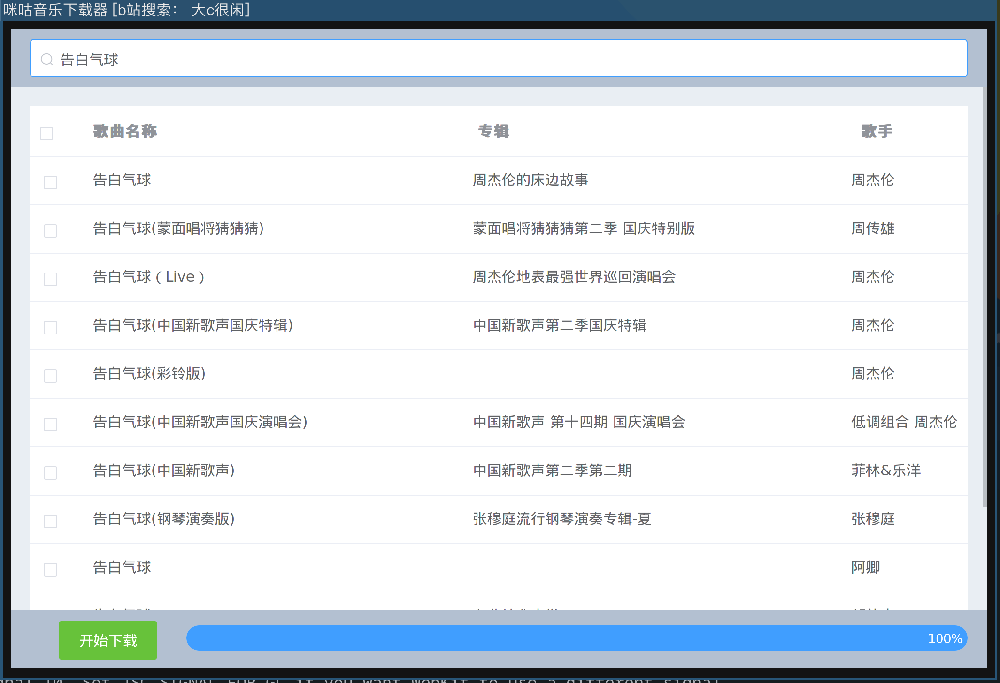

# 咪咕音乐下载器

开发过程 ： [https://www.bilibili.com/video/BV1tP4y1G7rL/](https://www.bilibili.com/video/BV1tP4y1G7rL/)

已编译的文件在build文件夹中

其中用到了一个自己的私有工具类，可能无法编译，该类主要做了http请求有类型转换

有go经验的稍微改动一下就你跑起来了。

Gui部分采用[wails 1.6](https://wails.app/)进行的开发。
